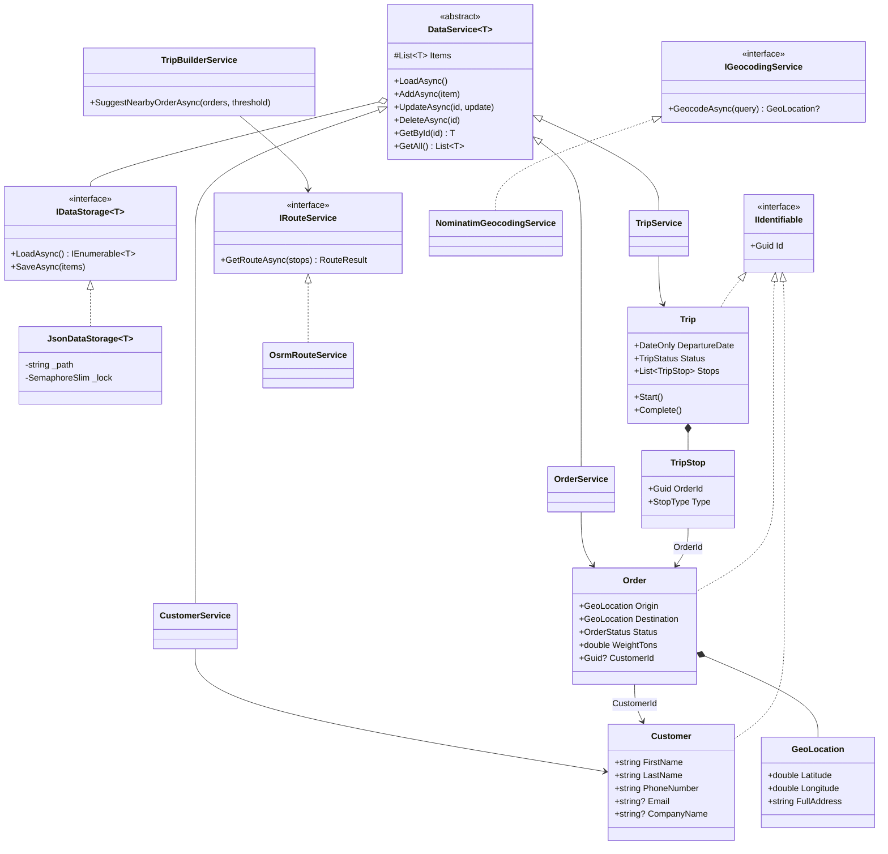

# Transport Manager

Semestrálna práca z predmetu **Jazyk C# a .NET**.

## 1. Popis riešenej úlohy

Desktopová aplikácia na evidenciu a plánovanie jázd pre malú dopravnú firmu. Hlavnou funkciou je skladanie efektívnych trás — spájanie zákaziek tak, aby vozidlo nešlo prázdne a aby sa minimalizovali zbytočné kilometre.

Aplikácia má dvojaké rozhranie:

- **Blazor Server UI** — denná práca dispečera (vizuálne plánovanie na mape,
  filtrovanie zákaziek, prehľad trás).
- **CLI** — skriptovateľný prístup k tým istým operáciám pre dávkové úlohy
  (hromadné pridanie zákaziek, automatizované stavanie trás).

Obe rozhrania zdieľajú rovnakú aplikačnú logiku v **Core** knižnici. Dáta sa
perzistujú do lokálnych JSON súborov.

## 2. Architektúra a diagram tried

Riešenie je rozdelené na tri projekty:

| Projekt | Typ | Obsah |
|---------|-----|-------|
| `Core` | Class Library | Modely, business logika, perzistencia, integrácia s OSRM/Nominatim |
| `CLI`  | Console App   | Tenký wrapper nad `Core` službami, ovládaný cez `System.CommandLine` |
| `Web`  | Blazor Server | Grafické rozhranie pre dispečera |

Závislosti tečú jedným smerom: `CLI → Core`, `Web → Core`. Core nepozná UI ani
CLI vrstvu.

### Class diagram (zjednodušený)



### Štruktúra priečinkov

```
TransportManager/
├── Core/
│   ├── Customer/       — Customer, CustomerService
│   ├── Order/          — Order, OrderService, OrderStatus
│   ├── Trip/           — Trip, TripService, TripStop, TripBuilderService
│   ├── Geocoding/      — GeoLocation, NominatimGeocodingService, GeoMath
│   ├── OSRM/           — OsrmRouteService, PolylineDecoder, RouteResult
│   └── Storage/        — DataService<T>, JsonDataStorage<T>, IIdentifiable
├── CLI/
│   ├── Program.cs
│   └── Commands/       — Customer/Order/Trip subcommands
└── Web/
    ├── Components/
    │   ├── Pages/      — Home, Orders, Customers, Trips
    │   ├── Shared/     — Map, Modal, TripCard, FormModaly, …
    │   └── Layout/
    └── wwwroot/        — JS (Leaflet), CSS (Tailwind)
```

## 3. Použité technológie

- **.NET 10** (preview), C# 13
- **Blazor Server** s interaktívnym render módom
- **System.CommandLine** 2.0 — parsovanie CLI argumentov
- **Tailwind CSS v4** — styling Web klienta
- **Leaflet.js 1.9.4** — interaktívna mapa
- **OSRM** (public demo server) — výpočet trás
- **Nominatim** (OpenStreetMap) — geokódovanie adries
- **System.Text.Json** — serializácia/deserializácia perzistovaných dát

## 4. Požiadavky na spustenie

- **.NET 10 SDK**
- **Node.js** (≥ 18) a **npm** — len pre build Tailwind CSS vo Web projekte
- internetové pripojenie pri prvom použití geokódovania a OSRM (oba API sú
  verejné a bez kľúča)

## 5. Manuál

### 5.1 Spustenie Web klienta

```bash
cd Web
npm install              # raz na začiatku, kvôli Tailwind CLI
npm run tailwind-once    # zostaví output.css
dotnet run
```

Aplikácia beží na `https://localhost:5001` (alebo podľa `launchSettings.json`).
Počas vývoja je pohodlnejšie `npm run dev`, ktoré paralelne spustí
`tailwind --watch` aj `dotnet watch`.

**Stránky:**

- `/` — plánovač: zoznam zákaziek so stavom *Nová* a mapa s navrhovanou trasou
- `/zakazky` — CRUD nad zákazkami, vyhľadávanie, filter podľa stavu
- `/zakaznici` — master-detail prehľad zákazníkov vrátane histórie zákaziek
- `/tripy` — prehľad naplánovaných, prebiehajúcich a dokončených tripov

### 5.2 Spustenie CLI

```bash
cd CLI
dotnet run -- --help
```

Po prvom spustení sa v `bin/Debug/net10.0/data/` vytvoria JSON súbory pre
zákazníkov, zákazky a tripy. CLI a Web každý pracujú nad **vlastnou kópiou**
dát vo svojom `bin` priečinku — tieto súbory nie sú zdieľané.

### 5.3 Príklady CLI príkazov

Tri vrcholové príkazy: `customers`, `orders`, `trips`. Každý má vlastné
podpríkazy, všetky podporujú `--help`.

**Zákazníci:**

```bash
# pridanie
dotnet run -- customers add -f Ján -l Novák -p "+421900111222" \
    -c "Doprava s.r.o." -i 12345678

# výpis a vyhľadávanie
dotnet run -- customers list
dotnet run -- customers list search "Novák"

# úprava (id z výpisu)
dotnet run -- customers update <guid> --phone "+421900999000"

# zmazanie
dotnet run -- customers delete <guid>
```

**Zákazky:**

```bash
# pridanie — adresy sa automaticky geokódujú cez Nominatim
dotnet run -- orders add -o "Bratislava" -d "Košice" -n "paleta tovaru"

# filtre
dotnet run -- orders list
dotnet run -- orders list status New
dotnet run -- orders list origin "Bratislava"

# update stavu
dotnet run -- orders update <guid> --status Assigned
```

**Tripy:**

```bash
# postavenie tripu z viacerých zákaziek na konkrétny dátum
dotnet run -- trips build 2026-06-01 --orders <guid1> <guid2> <guid3>

# zobrazenie detailu (vrátane zastávok)
dotnet run -- trips show <tripId>

# manipulácia so zastávkami
dotnet run -- trips add-order <tripId> <orderId>
dotnet run -- trips remove-order <tripId> <orderId>
dotnet run -- trips swap <tripId> 0 1

# životný cyklus
dotnet run -- trips start <tripId>
dotnet run -- trips complete <tripId>

# návrh zákaziek do 25 km od existujúcej trasy
dotnet run -- trips suggest <tripId> --threshold 25
```

## 6. Problémy, ktoré bolo treba vyriešiť

- **Race condition pri zápise do JSON.** Pri rýchlom Add/Update/Delete (najmä
  z CLI v slučke) sa stávalo, že dva paralelné `SaveAsync` prepísali súbor a
  jeden zápis sa stratil. Riešenie — `SemaphoreSlim(1,1)` v `JsonDataStorage`
  aj `DataService`, ktorý chráni `Items` aj následný `SaveAsync` ako jednu
  kritickú sekciu.
- **Rate limit Nominatim.** Verejný server povoľuje 1 request/sekundu, inak
  blokuje. Pridaný throttling v `NominatimGeocodingService`: semafór + uložený
  čas posledného requestu, pred ďalším requestom sa prípadne `Task.Delay`.
- **Dispose Leaflet mapy pri odpojení Blazor okruhu.** Pri navigácii preč zo
  stránky občas spadlo JS interop volanie, lebo SignalR okruh už bol mŕtvy.
  Riešené odchytením `JSDisconnectedException` a `TaskCanceledException` v
  `DisposeAsync` komponentu `Map`.
- **Asymetria stavu Order ↔ Trip.** Stav zákazky (`New / Assigned / EnRoute /
  Delivered`) je riadený z `TripCommands` — pri `trips start` sa všetky
  obsiahnuté zákazky prepnú na `EnRoute`, pri `trips delete` naopak späť na
  `New`. Tým je v CLI zaručené, že zákazka a trip sa nedostanú do nekonzistentného
  stavu (napr. „zaradená" zákazka v zmazanom tripe).
- **Toggle témy bez bliknutia.** Pri prepnutí tmavá ↔ svetlá blikal pôvodný
  motív; preriešené malým JS skriptom v `<head>`, ktorý téma aplikuje pred
  vyrenderovaním obsahu.
- **Kvalita geokódovania cez Nominatim.** Verejný Nominatim vracia
  nekonzistentné výsledky — pri menších obciach a presnejších adresách
  (ulica + číslo) často nedohľadá konkrétny bod a vráti len ťažisko obce
  alebo `null`. V rámci semestrálnej práce sa s tým žije, no pri reálnom
  nasadení by bolo treba prejsť na plateného poskytovateľa (napr. Google
  Geocoding API, Mapbox), ktorý má presnejšiu adresnú databázu.

## 7. Použitie AI nástrojov

V projekte bol využitý **Claude (Anthropic)** ako asistent. Použitie sa dá
rozdeliť na dve oblasti:

### 7.1 Dizajn UI

Vizuálny návrh aplikácie vznikol v nástroji
[**claude.ai/design**](https://claude.ai/design/p/019e21f7-f481-76d4-b669-57882303ea03?file=TransportManager.html&via=share),
kde AI vygenerovalo statické HTML/CSS makety jednotlivých stránok. Vlastnú
**architektúru, štruktúru komponentov, stavovú logiku a dynamiku** (Blazor
komponenty, parametrizácia, eventy, väzba na služby) som riešil samostatne.
AI som použil na pretvorenie dizajnu do HTML, lebo grafický návrh nie je
moja silná stránka. Statické makety som potom prerábal do Razor komponentov,
napájal ich na dáta z `Core` a dopĺňal interaktivitu.

### 7.2 Asistencia v kóde

Vybrané miesta v zdrojovom kóde, kde AI pomohlo s konkrétnou implementáciou,
sú označené komentárom `// Využitie generatívnej AI: <rozsah>` priamo v
súbore:

| Súbor | Rozsah pomoci AI |
|-------|------------------|
| `Core/Storage/JsonDataStorage.cs` | synchronizácia súbežných Save/Load pomocou `SemaphoreSlim` |
| `Core/Storage/DataService.cs` | ochrana in-memory kolekcie a perzistencie semafórom |
| `Core/Geocoding/NominatimGeocodingService.cs` | throttling 1 req/s — semafór + časovač posledného requestu |
| `Core/OSRM/PolylineDecoder.cs` | dekódovacia slučka (bitový posun, zig-zag dekódovanie polyline) |
| `Web/Components/Shared/Map.razor` | návrh JS interop vrstvy s Leafletom a ošetrenie disposingu odpojeného okruhu |

Mimo týchto miest bol AI použitý priebežne ako pomoc pri refaktoringu a
hľadaní chýb.

## 8. Záver

Cieľ — funkčný, dvojrozhraňový systém na evidenciu prepravy nad spoločnou Core
knižnicou — sa podarilo splniť. Aplikácia demonštruje viacero tém preberaných
na predmete: kolekcie a LINQ (filtre v `OrderService`, vyhľadávanie zákazníkov),
generický `DataService<T>` nad `IDataStorage<T>`, JSON serializáciu, `async/await`
pri I/O (HTTP volania, súborové operácie), výnimky pre nelegálne prechody stavov
tripu, parsovanie argumentov cez `System.CommandLine`.

### Návrhy na ďalší rozvoj

- **Autentifikácia a viacuživateľský režim.** Súčasná verzia je jednoužívateľská
  aplikácia; pri reálnom nasadení by bolo treba role (dispečer, vodič, admin)
  a oddelenie dát na úrovni firmy.
- **Otvorené API endpointy.** Verejné REST endpointy na pridávanie zákaziek
  z externých zdrojov — napr. priamo z firemnej webstránky alebo formulára pre
  zákazníkov, kde si objednávku zadajú sami.
- **Rozšírenie evidencie.** Doplnenie ďalších entít, ktoré sa v doprave reálne
  sledujú — **vozidlá** (ŠPZ, typ, nosnosť, STK), **prívesy** (priradené
  k vozidlu) a **tržby** (evidencia príjmov za jednotlivé tripy/zákazky).
- **Prechod na SQLite.** Vyšší počet vzťahov medzi entitami (zákazník → zákazky
  → trip → vozidlo → príves) sa v JSON modeluje neprirodzene — relačná databáza
  (SQLite cez EF Core) by zjednodušila dotazy, integritu cez cudzie kľúče
  a transakcie. Zároveň by tým vzniklo zdieľané úložisko medzi CLI a Web.
- **Automatická optimalizácia trasy.** `TripBuilderService` dnes vie navrhnúť
  okolité zákazky pomocou `SuggestNearbyOrderAsync`, no neprehadzuje poradie
  zastávok. Vhodné rozšírenie je heuristický TSP algoritmus (napr. nearest
  neighbor + 2-opt), ktorý by automaticky preusporiadal pickupy/dropoffy tak,
  aby celkový počet kilometrov bol minimálny.
- **Lepšie geokódovanie.** Náhrada Nominatim za plateného poskytovateľa
  (Google Geocoding API alebo Mapbox) kvôli presnosti pri menších obciach
  a konkrétnych adresách.
